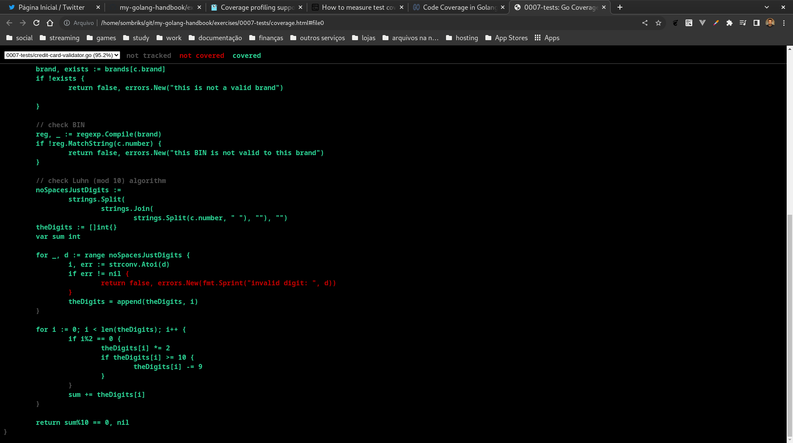

# What is this module thing

In order to sample tests, i had to run the
[go mod init](https://go.dev/ref/mod#go-mod-init) command.

Modules when published have to point to the public repo.

Another alternative was
[to disable go modules](https://github.com/google/oss-fuzz/issues/2878) but
modules ae here to stay so let's get used to them.

To make go understand this folder as a module, i just did:

```bash
go mod init 0007-tests
```

And that's it.

Now although i didn't made a main function to serve as entrypoint, i can run the
tests using this command:

```bash
go test -v
```

## Don't forget coverage

One nice thing to have when you already have tests is to enable coverage.

Coverage helps to understand what is actually really getting tested, and thus
produce new or better testcases.

In order to enable coverage, install the cover tool:

```bash
go get golang.org/x/tools/cmd/cover
```

Now your test command takes this form:

```bash
go test -v -coverprofile=coverage.out
go tool cover -html=coverage.out -o coverage.html
```



Or using your preferred IDE:

<div style="display:flex;">
<div style="margin:1em;">


</div>
<div style="margin:1em;">


</div>
</div>

And that's it!
