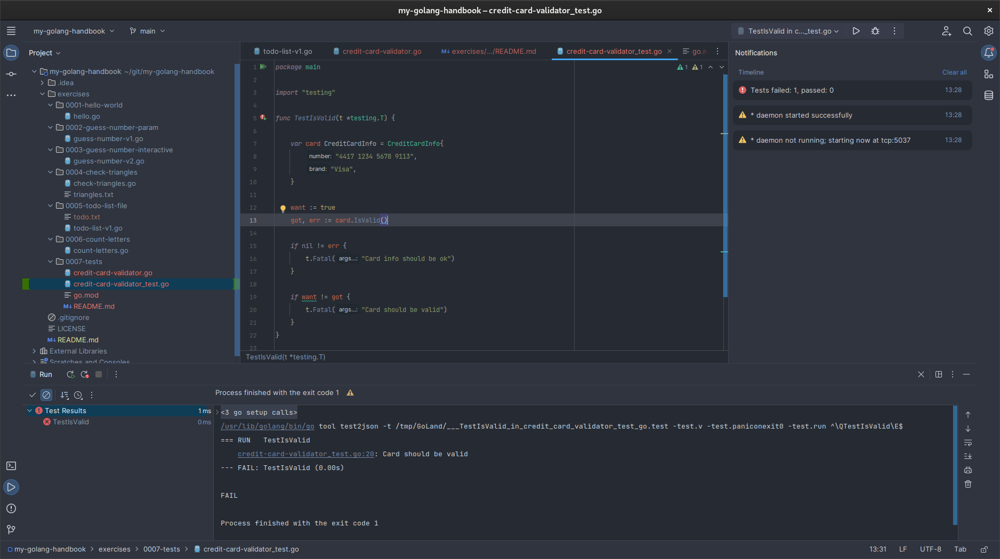
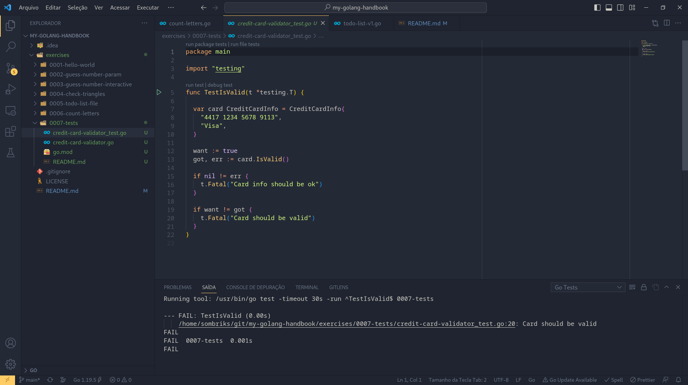

# What is this module thing

In order to sample tests, i had to run the
[go mod init](https://go.dev/ref/mod#go-mod-init) command.

Modules when published have to point to the public repo.

Another alternative was
[to disable go modules](https://github.com/google/oss-fuzz/issues/2878) but
modules ae here to stay so let's get used to them.

To make go understand this folder as a module, i just did:

```bash
go mod init 0007-tests
```

And that's it.

Now although i didn't made a main function to serve as entrypoint, i can run the
tests using this command:

```bash
go test -v -cover -html=coverage.out
```

Or using your preferred IDE:

<div style="display:flex;">
<div style="margin:1em;">



</div>
<div style="margin:1em;">



</div>
</div>

And that's it!
